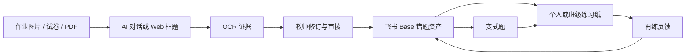

# shi-homework2lark

[](https://github.com/asong2022/shi-homework2lark/actions/workflows/ci.yml)

面向小学数学教师的对话式错题学习系统。它把作业图片、试卷或 PDF 中经过教师确认的错题，整理为来源清楚、可修订、可复用的题目资产，并通过飞书多维表格连接后续的变式题、精准练习与再练反馈。

当前版本是 Phase 1 / MVP。项目强调“教师把关、证据分层、数据可追溯”，不把 OCR 或 AI 输出直接当作可信题目，也不提供自动批改、学生账号或班级分析平台。

## 核心工作流



系统支持三种由用户明确选择的收集方式：

1. 教师精选：上传空白卷或单题图片，由教师选择需要收录的题目。
2. 匿名批改统计：空白卷加已批改作业，只汇总错情，不绑定学生身份。
3. 实名绑定统计：空白卷、已批改作业和私有名单共同完成身份核对；学号只留在本地私有映射中。

## 已实现能力

- Next.js Web：图片上传、自动候选、手动框题、移动缩放、合并和服务端裁图。
- FastAPI：原图、区域、裁图、OCRRun、人工修订、审核状态和规范化记录。
- OCR 抽象：Fake Provider、PaddleOCR 本地适配器、PaddleOCR-VL-1.6 托管 API 适配器。
- 题目检测：Fake Provider 与 Yescan 适配器；自动候选必须由教师确认。
- 飞书 Base：审核题目幂等发布、错题分组、变式题目录、练习与再练投影。
- `shi-homework2lark` Skill：对话式收题、错情整理、变式、组卷与反馈的统一入口。
- 本地 SQLite 和文件存储；数据库与文件系统均通过适配器边界隔离。

## 架构

```text
apps/web                         Next.js 教师框题界面
apps/api                         FastAPI 单体后端
packages/contracts               OpenAPI 契约
.agents/skills/shi-homework2lark 对话式错题工作流 Skill
.agents/skills/wumu-jihe-html    可复用题图子技能
docs                             产品、领域、数据流与 ADR
.trellis/spec                    项目开发约束
artifacts/skills                 已构建的 .skill 安装包
```

原始数据、机器派生数据和人工修订数据分层保存。核心关系为：

```text
SourceAsset
  -> ProblemRegion
  -> OCRRun (append-only)
  -> ProblemRevision (append-only)
  -> ReviewedProblem
  -> Lark Base projection
```

## 本地启动

### 环境要求

- Node.js 20.9+
- Python 3.11
- [uv](https://docs.astral.sh/uv/)

### 安装

```powershell
Copy-Item .env.example .env
npm ci
uv sync --directory apps/api --group dev
uv run --directory apps/api alembic upgrade head
```

macOS/Linux 可将第一行改为 `cp .env.example .env`。

### 启动 API

```powershell
uv run --directory apps/api uvicorn mistake_notebook_api.main:app --reload --port 8000
```

- API 健康检查：<http://localhost:8000/api/v1/health>
- OpenAPI：<http://localhost:8000/docs>

### 启动 Web

另开终端：

```powershell
npm run dev:web
```

访问 <http://localhost:3000>。

默认配置使用 Fake OCR、Fake 题框检测和 Fake 发布器，不访问外部服务，适合首次体验和自动化测试。

## 可选外部服务

所有密钥只能写入未纳入 Git 的 `.env`，不得写入源码、README、日志或测试夹具。

### PaddleOCR-VL-1.6 托管 API

```dotenv
OCR_PROVIDER=paddleocr_vl_api
PADDLEOCR_ACCESS_TOKEN=<your-token>
```

启用后，只应向服务商发送教师已确认的题目裁图。原图、裁图和原始返回仍在本地证据层保存。

### Yescan 题目检测

```dotenv
REGION_DETECTION_PROVIDER=yescan
YESCAN_API_KEY_ID=<your-back-client-id>
YESCAN_API_KEY=<your-secret>
```

业务层不依赖 Yescan 原始返回结构，也不会自动进行多 Provider 投票或静默降级。

### 飞书多维表格

```dotenv
PROBLEM_PUBLISHER=lark_cli
LARK_BASE_TITLE=<your-base-title>
```

需要先单独安装并登录 `lark-cli`。发布动作以稳定题目 ID 保证幂等；Base 是教师与 Agent 的长期目录，本地证据层仍是来源真相。

## 使用 Skill

开发事实源位于：

```text
.agents/skills/shi-homework2lark/
```

检查依赖：

```powershell
python .agents/skills/shi-homework2lark/scripts/doctor.py
```

查看三种收集模式：

```powershell
python .agents/skills/shi-homework2lark/scripts/workflow.py choices
```

已构建安装包位于 `artifacts/skills/shi-homework2lark.skill`。包内不含 Token、真实学生材料、Base ID 或本机绝对路径。

## 测试

```powershell
# Backend
uv run --directory apps/api pytest
uv run --directory apps/api ruff check .
uv run --directory apps/api ruff format --check .
uv run --directory apps/api mypy src

# Web
npm run lint:web
npm run typecheck:web
npm run test:web
npm run build:web

# Skill
python -m unittest discover -s .agents/skills/shi-homework2lark/tests -p "test_*.py"
```

浏览器端到端测试需先安装 Chromium：

```powershell
npx playwright install chromium
npm run test:e2e
```

## 隐私与安全

这个发行快照不包含真实学生名单、作业图片、PDF、数据库、Base token 或 OCR/API 密钥。运行时仍请遵守以下原则：

- 不把学生身份写入仓库、日志或公开 Issue。
- 原图和裁图只发送给本次明确启用的 Provider。
- `.env`、`data/`、`storage/`、`output/` 和生成练习材料保持私有。
- 密钥一旦误提交，立即撤销并重新生成；仅从 Git 历史删除是不够的。

更多要求见 [SECURITY.md](./SECURITY.md)。

## 文档

完整产品与架构文档从 [docs/index.md](./docs/index.md) 开始。当前范围、领域模型、数据流、Provider 抽象、规范化记录、验收标准和 Roadmap 均已记录。

## 贡献

提交变更前请阅读 [CONTRIBUTING.md](./CONTRIBUTING.md)。任何示例材料必须是合成数据或已经可靠匿名化的数据。

## 许可

当前仓库尚未声明开源许可证。除非仓库所有者另行授权，保留全部权利。
